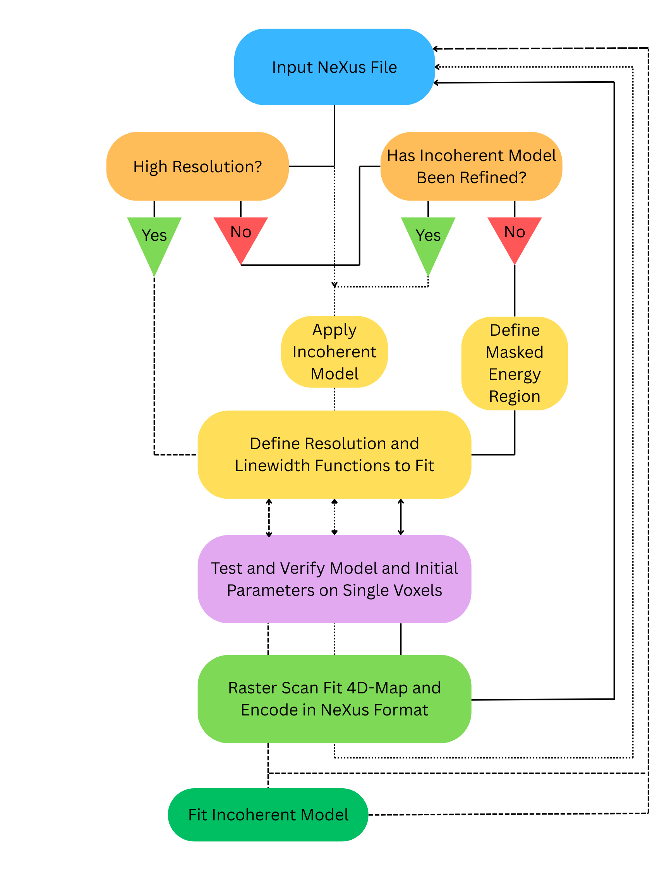

Installation
============

Clone the repo and install dependencies: ::

    bash
    git clone https://github.com/JColes-Physics/QENSfitter4D.git
    cd QENSfitter4D
    pip install .

.. note:: The plugin is designed to install all required dependencies, including NeXpy. While the GUI will not operate without NeXpy, the foundational functions should be capable of being run independently of the GUI.

NeXpy GUI Plugin Setup
----------------------

After installation, run NeXpy using::

    nexpy

or using::

    nexpy -r

The -r option restores all files loaded in the previous session.

Using the window menu at the top of the window/screen under the 'File' dropdown menu select 'Manage Plugins...' Here, all installed plugins are listed and able to be reordered based on personal preference. Choose prefered placement of the plugin and select 'Save.' This will add a new tab 'QENS' to the window menu at the top of the window/screen.

Outline of Functionality
------------------------

Outlined here is a generalized outline of the framework built for analysis of 4D datasets. This framework enables users to load 4D-QENS datasets (e.g., in NeXus format), interactively fit selected voxels or cuts to establish appropriate models and initial parameters, and then propagate those parameters through automated fitting of larger regions of (\mathbf{Q},\omega) space. Essential features include masking of problematic energy-transfer windows, optional pre-fitting of hopping-model values, and standardized uncertainty propagation.